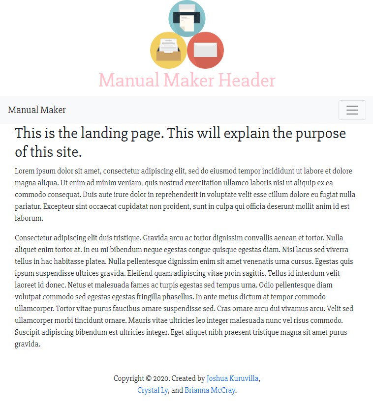

#  Manual Maker  

A pdf-creator for business purposes. 

[Check our progress here.](https://manualmaker.herokuapp.com/)

## Technologies

1. MongoDB
2. React Front-end
  > Reactstrap Library
  > Bootstrap
3. NodeJS
4. ExpressJS
5. Puppeteer for PDF generation

### How it works

* Landing page that explains purpose and instructions
* Generate Manual page-- takes you through prompts about details of manual creation
* Finished Page-- contains PDF generated; provides link to save and to return to homepage.

### Current Design

### Authors
[Josh Kuruvilla](https://github.com/joshkuruvilla512), [Crystal Ly](https://github.com/cml2377), [Brianna McCray](https://github.com/bwmccray)