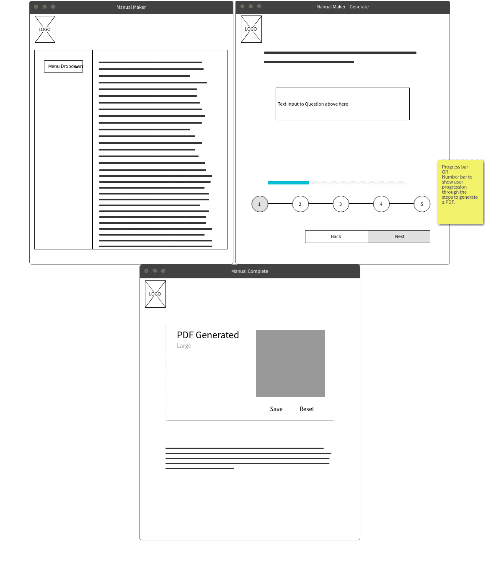

#  Manual Maker  

A pdf-creator for business purposes. 

## Technologies

MySQL database-- for raw information for manuals? 
React Front-end
NodeJS ?
ExpressJS ?

### How it works

* Landing page that explains purpose and instructions
* Generate Manual page-- takes you through prompts about details of manual creation
* Finished Page-- contains PDF generated; provides link to save and to return to homepage.

### Authors
Josh Kuruvilla, Crystal Ly, Brianna McCray